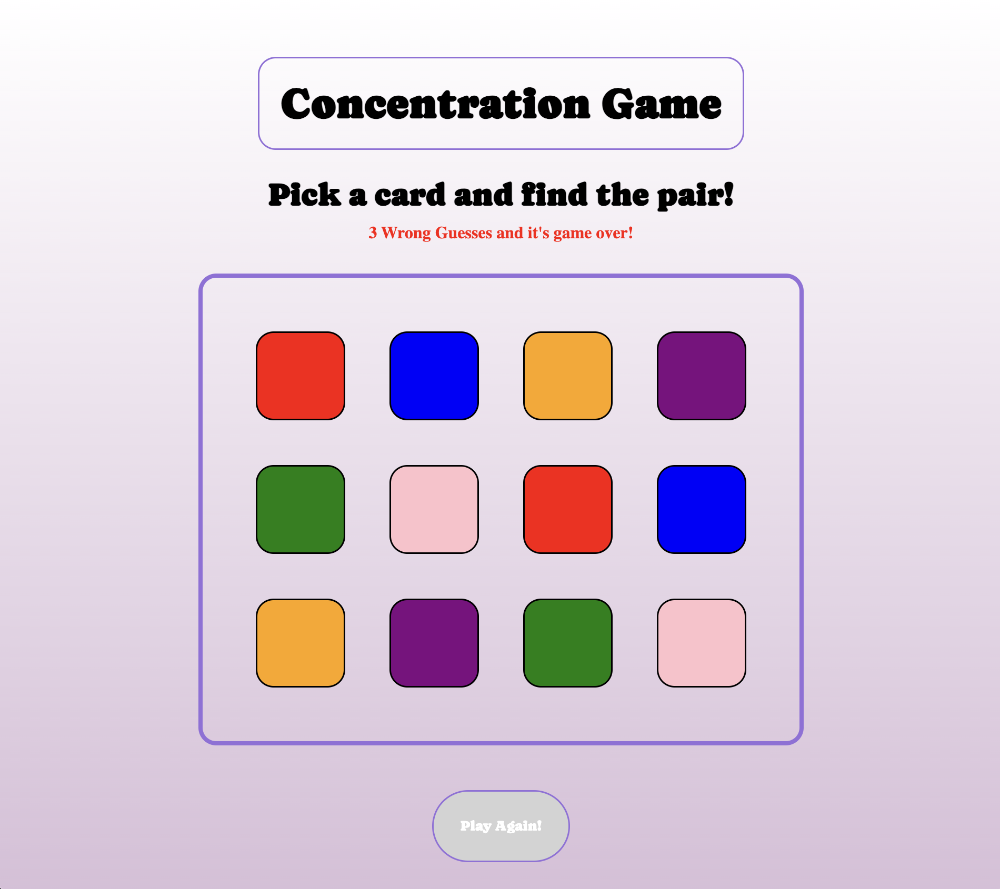
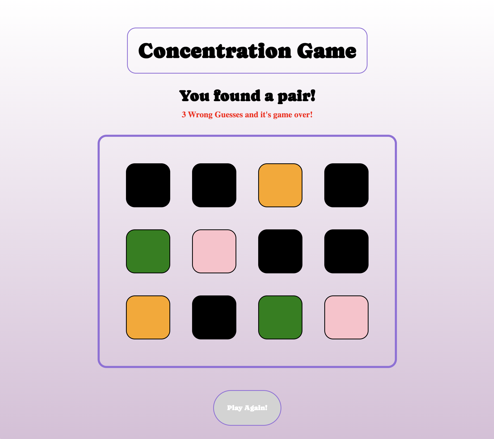
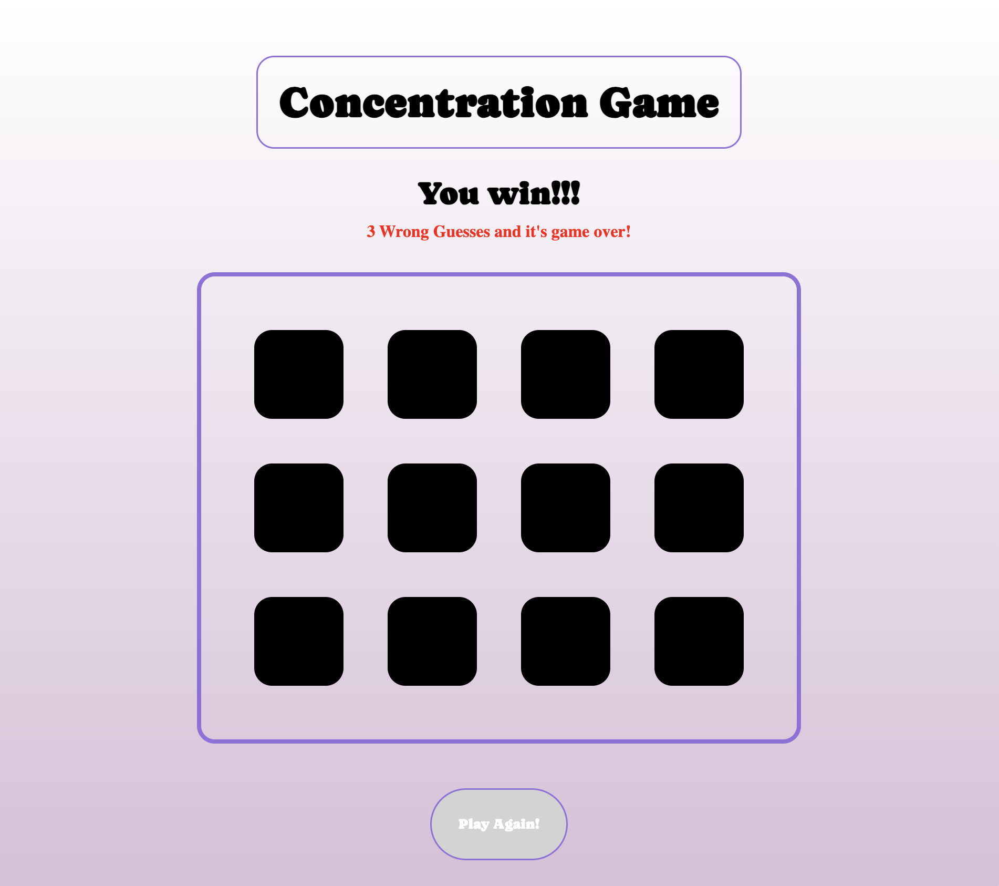
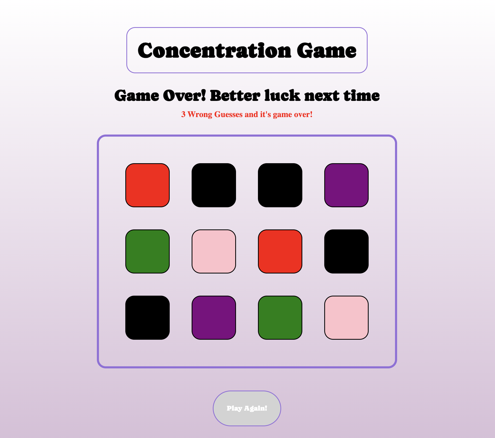

# Concentration Game

### [Play the game](https://janicavc.github.io/Concentration-Game/)

---
## Objective and Rules
To win the game the player must pair all of the colors correctly. To start the game the player will open the game on a browser. Once the game is open the player will select a card, once the first card is chosen the player will select a second card. If the cards are the same color they will become a pair and if the cards are not the same color that will count as a wrong guess towards the player. The player gets 3 wrong guesses until it's game over!
---
### Game Preview

---
### Game In Progress

---
### Game Win Message

---
### Game Lose Message

---
## Code Preview
```js
function compareCards() {
    const card1 = flippedCards[0]
    const card2 = flippedCards[1]

    if (card1.style.backgroundColor === card2.style.backgroundColor) {

            card1.style.backgroundColor = 'black';
            card2.style.backgroundColor = 'black';
            pairs.push(card1, card2);
            message.innerHTML = "You found a pair!"; 
            points += 1;
            pairs = [];
            flippedCards = [];
            if (points === 6) {
                renderWin();
            }
        } else if (card1.style.backgroundColor !== card2.style.backgroundColor) {
            wrongGuess += 1
            message.innerHTML = "Try again!";
            flippedCards = [];
        }
    if (wrongGuess === 3) {
        message.innerHTML = 'Game Over! Better luck next time'
        gameOver();
    }
}
```
---
## Technologies Used
![HTML]
![CSS]
![Javascript]